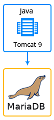

## Magnolia CMS

The JPS package deploys Magnolia CMS that initially contains 1 application server and 1 database container. 

### Highlights
This package is designed to deploy Magnolia CMS environment. It allows business users to confidently and easily enter, manage and publish content for the web and related channels. 
Magnolia CMS allows web marketing experts to control branding and content life cycles across a multitude of web sites, languages, brands and channels; and developers to easily extend and customize the content management system to meet business and editorial needs.

### Environment Topology

### Specifics

Layer                |     Server    | Number of CTs   by default | Cloudlets per CT   (reserved/dynamic) | Options
-------------------- | --------------| :----------------------------: | :---------------------------------------: | :-----:
AS                   | Tomcat Java 	 |       1                        |           8 / 32                          | -
DB                   |    MariaDB    |       1                        |           2 / 8                           | -

* AS - Application server 
* DB - Database 
* CT - Container

**Magnolia CMS Version**: 6.2.8 
**Tomcat Version**: 9.x 
**Java Engine**: java11 
**MariaDB Database version**: 10.x

### Deployment

In order to get this solution instantly deployed, click the "**DEPLOY TO JELASTIC**" button, specify your email address within the widget, choose one of the [Jelastic Public Cloud providers](https://jelastic.cloud) and press Install.

To deploy this package to Jelastic Private Cloud, import [this JPS manifest](../../raw/master/manifest.jps) within your dashboard ([detailed instruction](https://docs.jelastic.com/environment-export-import#import)).

More information about Jelastic JPS package and about installation widget for your website can be found in the [Jelastic JPS Application Package](https://github.com/jelastic-jps/jpswiki/wiki/Jelastic-JPS-Application-Package) reference.
